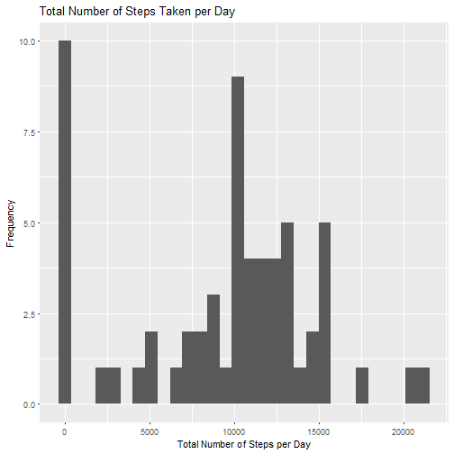
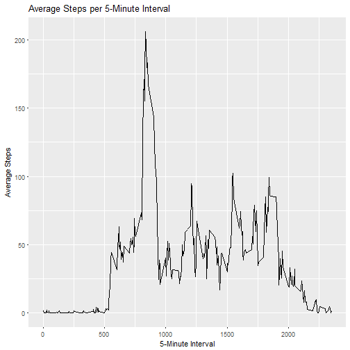
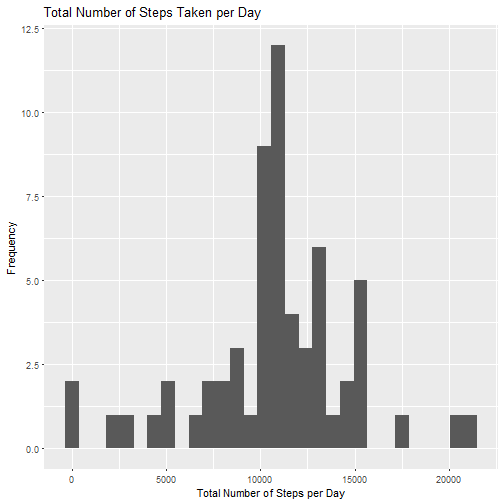
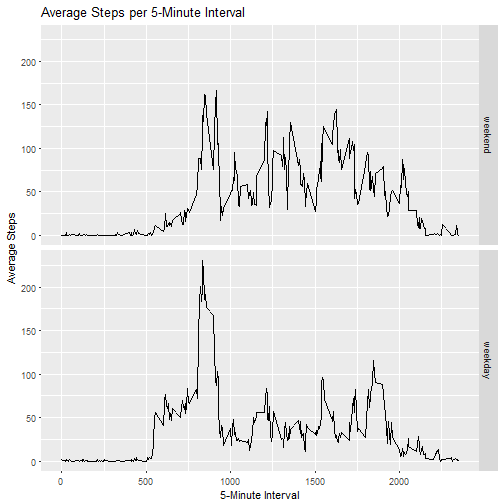

### Loading and preprocessing the data


```r
activity <- read.csv("data/activity.csv")
library(ggplot2)
```


### What is the mean total number of steps taken per day?
1.Calculate the total number of steps taken per day

```r
test <- with(activity, tapply(steps, date, sum, na.rm=TRUE))
```

2.Make a histogram of the total number of steps taken each day

```r
qplot(test,bins=30,xlab="Total Number of Steps per Day",ylab="Frequency",main="Total Number of Steps Taken per Day")
```



3.Calculate and report the mean and median of the total number of steps taken per day

```r
mean1 <- mean(test)
median1 <- median(test)
```
The mean of the total number of steps taken per day is 9354.2295082.  
The median of the total number of steps taken per day is 10395.


### What is the average daily activity pattern?

1.Make a time series plot of the 5-minute interval (x-axis) and the average number of steps taken, averaged across all days (y-axis)

```r
stepsByInterval<-aggregate(steps~interval,data=activity,mean,na.rm=TRUE)
g <- ggplot(stepsByInterval,aes(interval,steps)) 
g + geom_line() + labs(x="5-Minute Interval",y="Average Steps",title="Average Steps per 5-Minute Interval")
```



2.Which 5-minute interval, on average across all the days in the dataset, contains the maximum number of steps?

```r
max1 <- subset(stepsByInterval,steps==max(stepsByInterval$steps))
maxInterval <- max1$interval
maxSteps <- max(stepsByInterval$steps)
```
The 835th interval contains the maximum number of steps (206.1698113 steps).


### Imputing missing values
1.Calculate and report the total number of missing values in the dataset (i.e. the total number of rows with NAs)

```r
sumNA <- sum(is.na(activity$steps))
```
The total number of missing values in the dataset is 2304.

2.Devise a strategy for filling in all of the missing values in the dataset.   
The solution is to replace each missing value with the mean number of steps for that interval (use that interval's stepsByInterval$steps value).

```r
naValues <- subset(activity, is.na(activity))
for (i in 1:nrow(naValues)) {
	naValues[i,1] <- subset(stepsByInterval, interval==naValues[i,3])$steps
}
```
The variable naValues contains the new imputed values for each missing value.

3.Create a new dataset that is equal to the original dataset but with the missing data filled in.

```r
activityNew <- activity
activityNew[is.na(activity),1] <- naValues$steps
```

4.Make a histogram of the total number of steps taken each day.  

```r
test1 <- with(activityNew, tapply(steps, date, sum, na.rm=TRUE))
qplot(test1,bins=30,xlab="Total Number of Steps per Day",ylab="Frequency",main="Total Number of Steps Taken per Day")
```


  
Calculate and report the mean and median total number of steps taken per day.  

```r
mean2 <- mean(test1)
median2 <- median(test1)
```
The mean of the total number of steps taken per day is 1.0766189 &times; 10<sup>4</sup>.  
The median of the total number of steps taken per day is 1.0766189 &times; 10<sup>4</sup>.  

Do these values differ from the estimates from the first part of the assignment? What is the impact of imputing missing data on the estimates of the total daily number of steps?

```r
meanDif <- mean2-mean1
medianDif <- median2-median1
```
These statistics differ from the estimates from the first part of the assignment.  
Imputing missing data has increased the mean of the total daily steps by 1411.959171 and increased the median of the total daily steps by 371.1886792.  
In the original calulations, the mean and median were found by removing any missing values (NA). Now that more values (numbers of steps > 0) have been added to the dataset, it is expected that the mean and median of the daily totals would increase.


### Are there differences in activity patterns between weekdays and weekends?
1.Create a new factor variable in the dataset with two levels - "weekday" and "weekend" indicating whether a given date is a weekday or weekend day.

```r
dayNames <- weekdays(as.Date(activityNew$date))
dayClass <- dayNames == "Sunday" | dayNames == "Saturday"
activityNew$dayClass <- factor(dayClass,levels=c("TRUE","FALSE"),labels=c("weekend","weekday"))
```
2.Make a panel plot containing a time series plot of the 5-minute interval (x-axis) and the average number of steps taken, averaged across all weekday days or weekend days (y-axis).

```r
stepsByInterval1<-aggregate(activityNew$steps, list(dayClass=activityNew$dayClass,interval=activityNew$interval),mean)
g <- ggplot(stepsByInterval1,aes(interval,x)) 
g + geom_line() + labs(x="5-Minute Interval",y="Average Steps",title="Average Steps per 5-Minute Interval") + facet_grid(dayClass~.)
```



